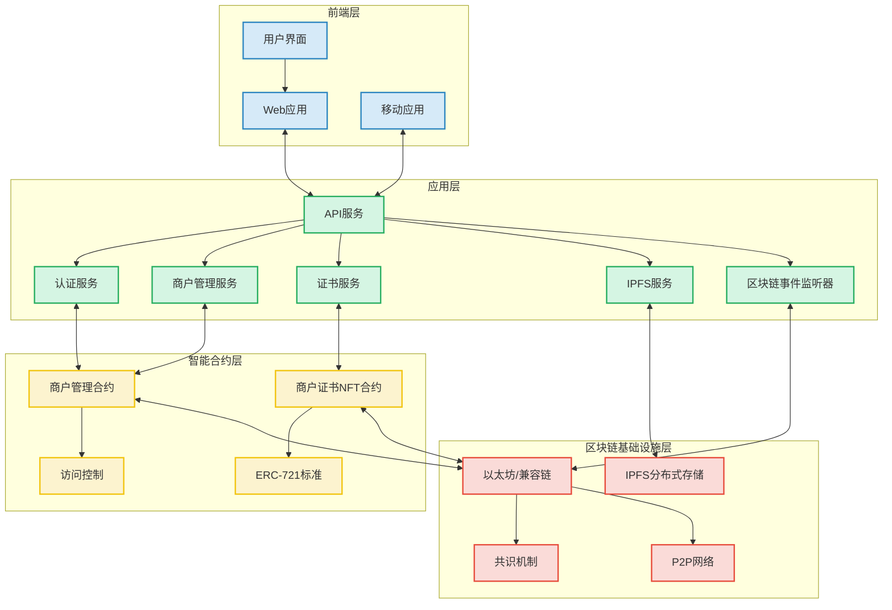

# 区块链商户认证系统架构图

## 1. 系统架构概述

区块链商户认证系统是一个基于区块链技术的分布式应用程序，旨在为商户提供可信的身份认证和证书管理服务。本系统采用多层架构设计，包括前端层、应用层、智能合约层和区块链基础设施层，实现了商户认证的全流程数字化和去中心化管理。

## 2. 系统架构图

## 3. 架构层次说明

### 3.1 前端层

前端层是系统与用户交互的界面，提供了多种访问方式：

- **用户界面**：提供直观的操作界面，包括商户注册、认证申请、证书查询等功能。
- **Web应用**：基于响应式设计的网页应用，支持PC端和移动端访问。
- **移动应用**：原生移动应用，提供更便捷的移动端访问体验，支持证书扫码验证等功能。

### 3.2 应用层

应用层是系统的业务逻辑处理中心，负责连接前端与区块链：

- **API服务**：统一的接口服务，处理前端请求并与各个微服务交互。
- **认证服务**：处理用户身份验证、权限管理和登录会话管理。
- **商户管理服务**：处理商户信息的增删改查，以及商户审核流程管理。
- **证书服务**：处理证书的申请、验证、查询和状态管理。
- **IPFS服务**：处理与IPFS的交互，包括商户元数据和证书数据的上传与获取。
- **区块链事件监听器**：监听区块链上的事件，如商户状态变更、证书铸造等，并更新系统状态。

### 3.3 智能合约层

智能合约层是系统的核心业务逻辑实现，部署在区块链上：

- **商户管理合约(MerchantManager)**：实现商户实体的管理，包括商户的创建、审核、更新和状态管理。
- **商户证书NFT合约(MerchantNFT)**：实现证书实体的管理，基于ERC-721标准，负责证书的铸造、验证、撤销和续期。
- **访问控制**：实现基于角色的权限控制，确保只有授权用户能执行特定操作。
- **ERC-721标准**：遵循以太坊NFT标准，确保证书的唯一性和可交易性。

### 3.4 区块链基础设施层

区块链基础设施层提供了系统的底层支持：

- **以太坊/兼容链**：提供智能合约的运行环境和区块链的基础功能。
- **共识机制**：确保区块链网络中的数据一致性和安全性。
- **P2P网络**：实现区块链节点之间的通信和数据同步。
- **IPFS分布式存储**：存储商户元数据和证书详细信息，提供去中心化的数据存储解决方案。

## 4. 数据流与交互

### 4.1 商户注册与认证流程

1. 用户通过前端界面提交商户注册申请
2. 应用层验证申请数据并将商户元数据上传至IPFS
3. 应用层调用智能合约创建商户记录
4. 管理员通过前端界面审核商户申请
5. 审核通过后，智能合约更新商户状态并触发事件
6. 应用层监听到事件后，调用证书NFT合约铸造商户证书
7. 证书信息存储在区块链上，证书详细数据存储在IPFS中

### 4.2 证书验证流程

1. 用户通过前端界面输入证书ID或扫描证书二维码
2. 应用层调用智能合约验证证书有效性
3. 智能合约返回证书状态和相关信息
4. 应用层从IPFS获取证书详细信息
5. 前端展示证书验证结果和详细信息

## 5. 技术特点

### 5.1 去中心化与透明性

系统利用区块链技术的去中心化特性，确保商户认证过程的透明性和不可篡改性。所有认证记录和证书信息都存储在区块链上，可被公开验证。

### 5.2 基于NFT的数字证书

系统采用NFT技术实现商户证书的数字化，每个证书都是唯一的、不可复制的数字资产，具有明确的所有权和可验证性。

### 5.3 分布式存储

系统使用IPFS分布式存储技术存储商户元数据和证书详细信息，避免了中心化存储的单点故障风险，同时提高了数据的可用性和持久性。

### 5.4 智能合约自动化

系统通过智能合约自动化实现商户认证的关键业务逻辑，如证书的自动过期、状态更新等，减少了人工干预，提高了系统效率和可靠性。

## 6. 与E-R图的映射关系

本架构图与系统E-R图紧密关联，主要体现在：

1. **实体映射**：E-R图中的商户、用户、管理员和证书实体，在架构中分别通过商户管理合约和证书NFT合约实现。

2. **关系映射**：E-R图中定义的各实体间关系，在架构中通过智能合约的函数调用和事件机制实现。

3. **属性映射**：E-R图中定义的实体属性，在架构中通过智能合约的状态变量和IPFS存储的元数据实现。

4. **业务逻辑映射**：E-R图中隐含的业务规则，在架构中通过应用层服务和智能合约的函数实现。

## 7. 安全性考虑

### 7.1 智能合约安全

系统采用严格的智能合约开发和审计流程，防止常见的智能合约漏洞，如重入攻击、整数溢出等。同时，系统实现了完善的访问控制机制，确保只有授权用户能执行特定操作。

### 7.2 数据隐私保护

系统在设计上考虑了数据隐私保护，敏感信息通过加密存储，并实现了基于角色的访问控制，确保用户只能访问其有权限的数据。

### 7.3 身份认证与授权

系统实现了基于区块链地址的身份认证和基于角色的授权机制，确保系统操作的安全性和可追溯性。

## 8. 可扩展性设计

### 8.1 模块化架构

系统采用模块化设计，各层次和组件之间通过明确的接口交互，便于功能扩展和组件替换。

### 8.2 跨链兼容性

系统设计考虑了跨链兼容性，可以部署在以太坊主网或其他兼容EVM的区块链网络上，如Polygon、BSC等。

### 8.3 API扩展性

系统提供了可扩展的API设计，便于未来集成更多的第三方服务和应用。

## 9. 总结

区块链商户认证系统的架构设计充分利用了区块链技术的特点，实现了商户认证的去中心化、透明化和自动化。通过多层架构设计，系统既保证了业务逻辑的灵活性，又确保了底层数据的安全性和不可篡改性，为商户提供了可信的身份认证和证书管理服务。