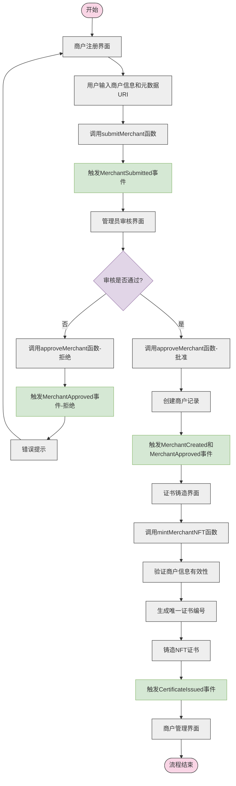
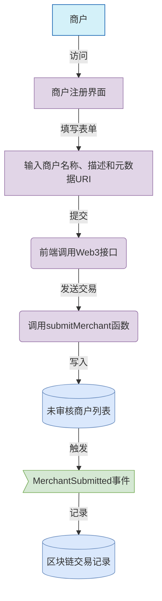
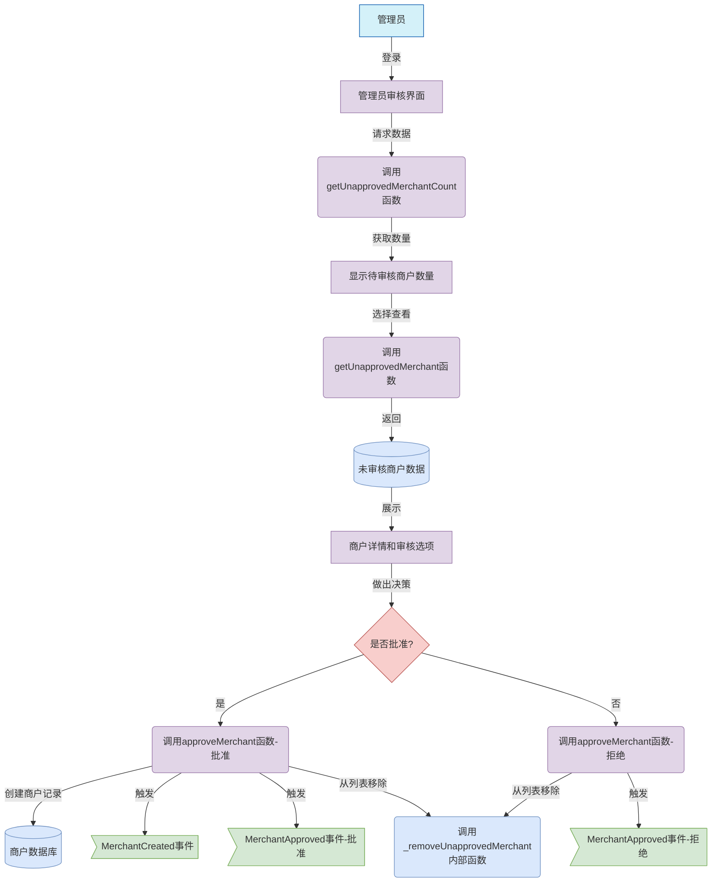
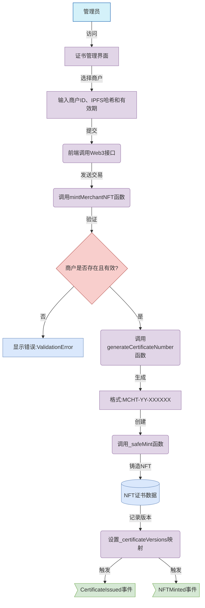
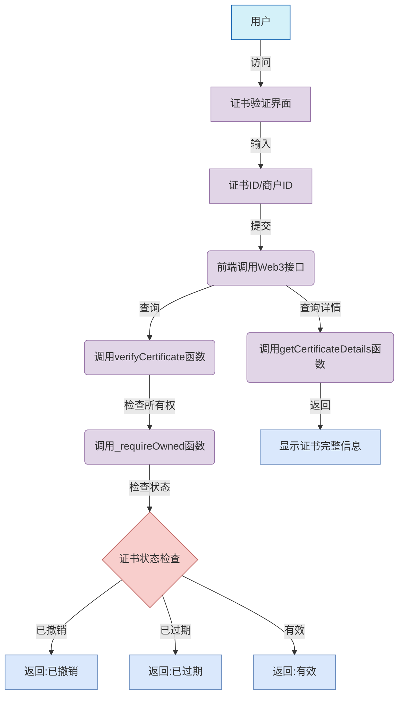
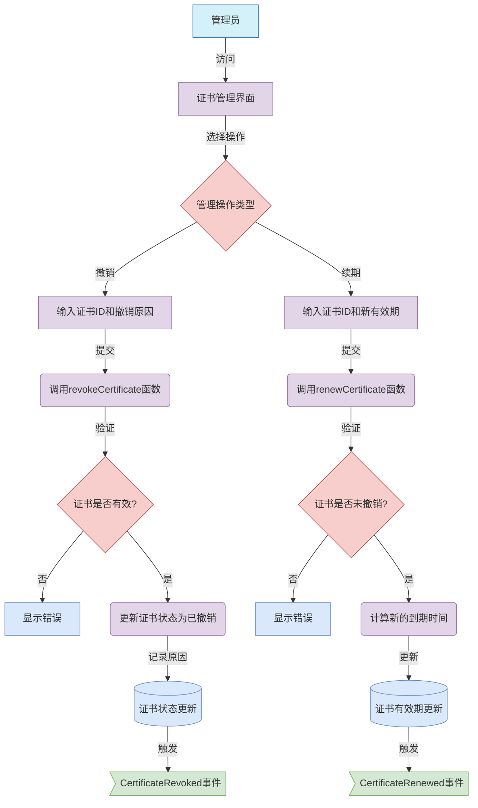
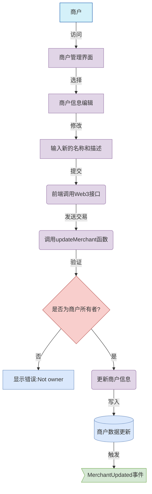
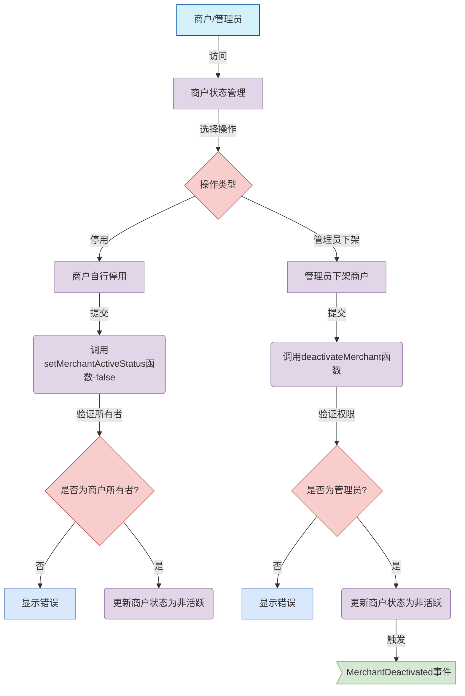
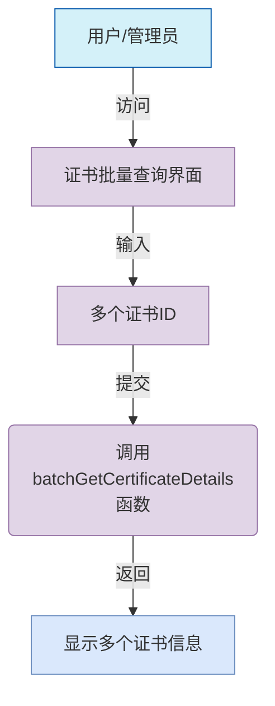

# 区块链商户认证系统流程图

## 系统概述

本文档展示了基于区块链技术的商户认证系统的主要业务流程。该系统利用智能合约和NFT技术实现商户的注册、审核、认证和证书管理等功能，为商户提供可信的数字身份认证服务。系统基于Solidity智能合约开发，采用ERC-721标准实现NFT证书，确保商户身份的唯一性和不可篡改性。

## 系统架构

本系统由以下核心组件构成：

1. **智能合约层**
   - **MerchantManager合约**：负责商户信息的管理，包括提交、审核、创建和更新等功能
   - **MerchantNFT合约**：基于ERC-721标准，负责NFT证书的铸造、验证、撤销和续期等功能

2. **前端应用层**
   - **商户端**：提供商户注册、信息更新和证书查看等功能
   - **管理员端**：提供商户审核、证书管理和系统监控等功能
   - **用户端**：提供证书验证和商户信息查询等功能

3. **区块链基础设施**
   - **以太坊网络**：提供去中心化的数据存储和交易验证
   - **IPFS**：存储商户证书的元数据和相关文件

## 功能结构划分图

图1：区块链商户认证系统功能结构图

```mermaid
flowchart TD
    %% 定义节点样式
    classDef system fill:#f5f5f5,stroke:#333,stroke-width:1px
    classDef module fill:#e1d5e7,stroke:#9673a6,stroke-width:1px
    classDef function fill:#dae8fc,stroke:#6c8ebf,stroke-width:1px
    classDef subfunction fill:#fff2cc,stroke:#d6b656,stroke-width:1px
    
    %% 系统根节点
    区块链商户认证系统[区块链商户认证系统] --> 商户端功能[商户端功能]
    区块链商户认证系统 --> 管理员端功能[管理员端功能]
    区块链商户认证系统 --> 用户端功能[用户端功能]
    区块链商户认证系统 --> 智能合约层[智能合约层]
    
    %% 商户端功能
    商户端功能 --> 商户注册[商户注册]
    商户端功能 --> 信息管理[信息管理]
    商户端功能 --> 证书查看[证书查看]
    商户端功能 --> 状态管理[状态管理]
    商户端功能 --> 信誉查询[信誉查询]
    
    %% 商户端子功能
    商户注册 --> 填写基本信息[填写基本信息]
    商户注册 --> 上传元数据[上传元数据]
    信息管理 --> 更新商户信息[更新商户信息]
    信息管理 --> 修改商户描述[修改商户描述]
    状态管理 --> 自行停用[自行停用]
    状态管理 --> 重新激活[重新激活]
    
    %% 管理员端功能
    管理员端功能 --> 商户审核[商户审核]
    管理员端功能 --> 证书管理[证书管理]
    管理员端功能 --> 系统监控[系统监控]
    管理员端功能 --> 信誉评分[信誉评分]
    管理员端功能 --> 商户下架[商户下架]
    
    %% 管理员端子功能
    商户审核 --> 查看待审核列表[查看待审核列表]
    商户审核 --> 批准商户[批准商户]
    商户审核 --> 拒绝商户[拒绝商户]
    系统监控 --> 交易监控[交易监控]
    系统监控 --> 事件日志[事件日志]
    信誉评分 --> 调整信誉分数[调整信誉分数]
    
    %% 证书管理子功能
    证书管理 --> 证书铸造[证书铸造]
    证书管理 --> 证书撤销[证书撤销]
    证书管理 --> 证书续期[证书续期]
    证书铸造 --> 生成证书编号[生成证书编号]
    证书铸造 --> 设置有效期[设置有效期]
    证书撤销 --> 记录撤销原因[记录撤销原因]
    
    %% 用户端功能
    用户端功能 --> 证书验证[证书验证]
    用户端功能 --> 商户查询[商户查询]
    用户端功能 --> 批量查询[批量查询]
    
    %% 用户端子功能
    证书验证 --> 验证有效性[验证有效性]
    证书验证 --> 查看证书详情[查看证书详情]
    商户查询 --> 按ID查询[按ID查询]
    商户查询 --> 按名称查询[按名称查询]
    
    %% 智能合约层
    智能合约层 --> MerchantManager合约[MerchantManager合约]
    智能合约层 --> MerchantNFT合约[MerchantNFT合约]
    
    %% 智能合约功能
    MerchantManager合约 --> 商户信息存储[商户信息存储]
    MerchantManager合约 --> 商户状态管理[商户状态管理]
    MerchantNFT合约 --> NFT证书铸造[NFT证书铸造]
    MerchantNFT合约 --> 证书状态管理[证书状态管理]
    
    %% 应用样式
    class 区块链商户认证系统 system
    class 商户端功能,管理员端功能,用户端功能,智能合约层 module
    class 商户注册,信息管理,证书查看,状态管理,信誉查询,商户审核,证书管理,系统监控,信誉评分,商户下架,证书铸造,证书撤销,证书续期,证书验证,商户查询,批量查询,MerchantManager合约,MerchantNFT合约 function
    class 填写基本信息,上传元数据,更新商户信息,修改商户描述,自行停用,重新激活,查看待审核列表,批准商户,拒绝商户,交易监控,事件日志,调整信誉分数,生成证书编号,设置有效期,记录撤销原因,验证有效性,查看证书详情,按ID查询,按名称查询,商户信息存储,商户状态管理,NFT证书铸造,证书状态管理 subfunction
```



## 简化流程图

图2：商户认证系统流程图



## 详细业务流程

## 商户注册流程


## 管理员审核流程


## NFT证书铸造流程


## 证书验证流程


## 证书管理流程


## 商户信息更新流程


## 商户状态管理流程


## 批量查询功能

```

## 流程说明

### 1. 商户注册流程

- **用户界面交互**：
  - 商户访问注册界面，填写表单，输入商户名称、描述和元数据URI（指向IPFS上的详细信息）
  - 前端应用通过Web3接口与区块链交互

- **智能合约交互**：
  - 系统调用`MerchantManager`合约的`submitMerchant`函数
  - 函数参数包括：`name`（商户名称）、`description`（商户描述）和`metadataURI`（元数据URI）
  - 合约将商户信息添加到`unapprovedMerchants`数组中，状态设为`isApproved: false`

- **事件触发与记录**：
  - 触发`MerchantSubmitted`事件，包含参数：商户名称、描述和所有者地址
  - 事件被记录到区块链上，可用于前端通知和状态更新

### 2. 管理员审核流程

- **审核准备**：
  - 管理员登录审核界面，系统调用`getUnapprovedMerchantCount`函数获取待审核商户数量
  - 管理员选择查看具体商户，系统调用`getUnapprovedMerchant(index)`函数获取详细信息

- **审核决策**：
  - 管理员查看商户详情，包括名称、描述和元数据URI等信息
  - 做出批准或拒绝的决策

- **合约处理**：
  - 系统调用`approveMerchant(index, approved)`函数处理审核结果
  - 参数`index`为未审核商户在数组中的索引，`approved`为布尔值表示是否批准
  - 如果批准（`approved=true`）：
    - 创建正式商户记录，分配唯一的`merchantId`
    - 设置初始信誉分数（默认60分）和活跃状态（`isActive=true`）
    - 触发`MerchantCreated`和`MerchantApproved`事件
  - 如果拒绝（`approved=false`）：
    - 仅触发`MerchantApproved`事件（带拒绝标志）
  - 无论批准还是拒绝，都会调用内部函数`_removeUnapprovedMerchant`从未审核列表中移除该商户

### 3. NFT证书铸造流程

- **铸造准备**：
  - 管理员访问证书管理界面，选择已审核通过的商户
  - 输入商户ID、IPFS哈希（存储证书元数据）和有效期（以秒为单位）

- **合约验证**：
  - 系统调用`MerchantNFT`合约的`mintMerchantNFT`函数
  - 函数首先通过`merchantManager.getMerchant(merchantId)`验证商户是否存在且有效
  - 如果商户不存在，抛出`ValidationError`错误

- **证书生成**：
  - 调用`generateCertificateNumber`函数生成唯一证书编号
  - 编号格式为`MCHT-YY-XXXXXX`，其中YY为年份后两位，XXXXXX为6位序列号
  - 通过`_safeMint`函数铸造NFT，接收者为商户所有者地址

- **证书数据存储**：
  - 创建`Certificate`结构体，包含：
    - `tokenId`：NFT的唯一标识
    - `merchantId`：关联的商户ID
    - `certificateNumber`：证书编号
    - `issueDate`：发行时间（当前区块时间戳）
    - `expiryDate`：到期时间（当前时间+有效期）
    - `ipfsHash`：IPFS哈希值
    - `status`：证书状态（初始为`Valid`）
    - `revokeReason`：撤销原因（初始为空）
  - 在`_certificateVersions`映射中记录证书版本

- **事件触发**：
  - 触发`CertificateIssued`事件，包含参数：tokenId、merchantId和到期时间
  - 触发`NFTMinted`事件，包含参数：tokenId和merchantId

### 4. 证书验证流程

- **验证请求**：
  - 用户访问证书验证界面，输入证书ID或商户ID
  - 前端通过Web3接口查询区块链

- **合约验证**：
  - 系统调用`verifyCertificate(tokenId)`函数
  - 函数首先通过`_requireOwned`检查证书是否存在
  - 然后检查证书状态：
    - 如果状态为`Revoked`，返回"已撤销"信息
    - 如果当前时间超过`expiryDate`，返回"已过期"信息
    - 否则返回"有效"状态

- **详细信息查询**：
  - 系统可调用`getCertificateDetails(tokenId)`获取完整证书信息
  - 返回包括商户ID、证书编号、发行时间、到期时间、IPFS哈希、状态和撤销原因等

### 5. 证书管理流程

- **撤销证书**：
  - 管理员输入证书ID和撤销原因
  - 系统调用`revokeCertificate(tokenId, reason)`函数
  - 函数验证证书是否存在且状态为有效
  - 更新证书状态为`Revoked`并记录撤销原因
  - 触发`CertificateRevoked`事件，包含参数：tokenId和撤销原因

- **续期证书**：
  - 管理员输入证书ID和新的有效期
  - 系统调用`renewCertificate(tokenId, newValidityPeriod)`函数
  - 函数验证证书是否存在且未被撤销
  - 计算新的到期时间（当前时间+新有效期）
  - 更新证书状态为`Valid`和新的到期时间
  - 触发`CertificateRenewed`事件，包含参数：tokenId和新的到期时间

### 6. 商户信息更新流程

- **信息编辑**：
  - 商户访问管理界面，选择信息编辑功能
  - 输入新的名称和描述

- **合约验证与更新**：
  - 系统调用`updateMerchant(merchantId, newName, newDescription)`函数
  - 函数首先验证调用者是否为商户所有者（`require(merchants[merchantId].owner == msg.sender)`）
  - 如果验证通过，更新商户信息
  - 触发`MerchantUpdated`事件，包含参数：merchantId和新名称

### 7. 商户状态管理流程

- **商户自行停用**：
  - 商户可以选择停用自己的账户
  - 系统调用`setMerchantActiveStatus(merchantId, false)`函数
  - 函数验证调用者是否为商户所有者
  - 更新商户状态为非活跃（`isActive=false`）

- **管理员下架商户**：
  - 管理员可以强制下架违规商户
  - 系统调用`deactivateMerchant(merchantId)`函数
  - 函数验证调用者是否为合约管理员（通过`onlyOwner`修饰符）
  - 更新商户状态为非活跃
  - 触发`MerchantDeactivated`事件，包含参数：merchantId、商户名称和所有者地址

### 8. 批量查询功能

- 用户或管理员可以批量查询多个证书信息
- 系统调用`batchGetCertificateDetails(tokenIds[])`函数
- 函数返回包含多个证书详细信息的数组
- 此功能适用于需要同时查看多个证书状态的场景，如商户拥有多个证书时

## 技术实现

### 智能合约架构

系统基于Solidity 0.8.20版本开发，采用以下智能合约实现核心功能：

1. **MerchantManager合约**：
   - **数据结构**：
     - `Merchant`结构体：存储商户基本信息，包括名称、描述、元数据URI、活跃状态、信誉分数、所有者地址和审核状态
     - `unapprovedMerchants`数组：存储待审核的商户信息
     - `merchants`映射：通过merchantId索引已审核通过的商户
   - **核心功能**：
     - 商户提交：`submitMerchant`函数
     - 商户审核：`approveMerchant`函数
     - 商户信息更新：`updateMerchant`函数
     - 信誉分数管理：`updateReputation`函数
     - 商户状态管理：`setMerchantActiveStatus`和`deactivateMerchant`函数
   - **访问控制**：
     - 继承OpenZeppelin的`Ownable`合约，实现管理员权限控制
     - 商户只能更新自己的信息，通过所有权验证确保安全

2. **MerchantNFT合约**：
   - **继承关系**：
     - 基于ERC721标准（`ERC721`、`ERC721Enumerable`）
     - 集成安全机制（`Ownable`、`ReentrancyGuard`、`Pausable`）
   - **数据结构**：
     - `Certificate`结构体：存储证书详细信息
     - `CertificateStatus`枚举：定义证书状态（有效、过期、已撤销）
     - `certificates`映射：通过tokenId索引证书信息
     - `_certificateVersions`映射：记录证书版本信息
   - **核心功能**：
     - 证书铸造：`mintMerchantNFT`函数
     - 证书验证：`verifyCertificate`函数
     - 证书管理：`revokeCertificate`和`renewCertificate`函数
     - 证书查询：`getCertificateDetails`和`batchGetCertificateDetails`函数
   - **安全机制**：
     - 使用`nonReentrant`修饰符防止重入攻击
     - 使用`whenNotPaused`修饰符支持紧急暂停
     - 自定义错误类型提高gas效率和错误处理

### 前端实现

前端采用React框架开发，通过Web3.js或ethers.js库与智能合约交互：

1. **用户界面组件**：
   - **AdminPanel**：管理员界面，包含未审核商户列表、审核操作面板和系统管理功能
   - **MerchantPortal**：商户门户，提供注册表单、信息管理和证书查看功能
   - **CertificateViewer**：证书查看器，支持证书验证和详情展示
   - **NFTManager**：证书管理界面，提供铸造、撤销和续期功能

2. **Web3集成**：
   - 使用MetaMask或WalletConnect实现钱包连接
   - 通过ABI（应用二进制接口）与智能合约交互
   - 实现事件监听，实时更新界面状态

3. **IPFS集成**：
   - 使用IPFS存储商户详细信息和证书元数据
   - 通过IPFS哈希在区块链上记录数据引用，降低存储成本

### 数据流向

1. **商户注册流程**：
   - 前端表单 → Web3接口 → MerchantManager合约 → 区块链存储 → 事件触发 → 前端更新

2. **证书铸造流程**：
   - 管理界面 → Web3接口 → MerchantNFT合约 → NFT铸造 → 证书数据存储 → 事件触发 → 前端更新

3. **证书验证流程**：
   - 验证界面 → Web3接口 → MerchantNFT合约 → 状态检查 → 结果返回 → 前端显示

## 安全与隐私

### 区块链安全机制

1. **数据不可篡改性**：
   - 所有商户信息和证书数据一旦写入区块链，无法被篡改
   - 历史记录完整保存，支持全流程审计

2. **智能合约安全**：
   - 使用OpenZeppelin安全库，采用经过审计的合约模板
   - 实现访问控制机制，确保只有授权用户可以执行特定操作
   - 使用`ReentrancyGuard`防止重入攻击
   - 实现`Pausable`机制，支持紧急情况下的系统暂停

3. **交易验证**：
   - 所有操作通过区块链交易执行，需要签名验证
   - 关键操作（如证书撤销）需要管理员权限

### 隐私保护

1. **数据分层存储**：
   - 核心数据（如商户ID、证书状态）存储在区块链上
   - 详细信息（如商户详细资料、证书图像）存储在IPFS上
   - 通过哈希引用连接两层数据，平衡透明性和隐私

2. **权限控制**：
   - 商户只能访问和修改自己的信息
   - 管理员拥有系统管理权限，但无法修改商户原始数据
   - 证书验证过程不暴露商户敏感信息

3. **数据可见性**：
   - 公开数据：证书状态、有效期、商户名称等
   - 受限数据：商户详细信息、交易历史等
   - 通过前端访问控制限制敏感信息的展示

### 系统可靠性

1. **错误处理**：
   - 使用自定义错误类型（如`CertificateError`、`ValidationError`）提高错误处理效率
   - 前端实现友好的错误提示，引导用户正确操作

2. **状态监控**：
   - 通过事件机制实现系统状态的实时监控
   - 管理员界面提供系统运行状态和关键指标的展示

3. **升级机制**：
   - 证书版本控制支持系统升级
   - 通过版本映射确保历史证书的兼容性